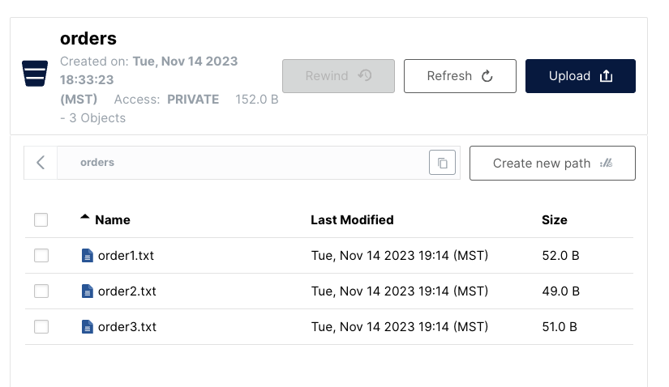

# Instructions

In this quickstart, you'll create a microservice to demonstrate Dapr's bindings API to work with external systems as inputs and outputs. The service listens to input binding events from a system CRON and then outputs the contents of local data to a MinIO output binding via the S3 interface.

Visit [this](https://docs.dapr.io/developing-applications/building-blocks/bindings/) link for more information about Dapr and Bindings.

> **Note:** This example leverages the Dapr SDK.  If you are looking for a Bindings example using HTTP REST only [click here](https://github.com/dapr/quickstarts/tree/master/bindings/java/http).

## Pre-requisites

- Dapr runtime and CLI: https://docs.dapr.io/getting-started/install-dapr-cli/

## Create Local MinIO Server

1. Create a MinIO server locally by following these instructions:

  - MacOS: https://min.io/docs/minio/macos/index.html
  - Windows: https://min.io/docs/minio/windows/index.html

  ``` bash
  ## Start the server (MacOS)
  minio server ~/data --console-address :9090

  ## Start the server (Windows)
  .\minio.exe server C:\minio --console-address :9090
  ```

2. Open the console in a browser at `http://127.0.0.1:9090/login` and login with the regular admin credentials `minioadmin:minioadmin`.

3. Create an access key to use with the Dapr component using the Access Keys page at `http://127.0.0.1:9090/access-keys`.

4. Update the [minio-s3.yaml](./resources/minio-s3.yaml) file `accessKey` and `secretKey` metadata properties with your newly created access and secret key values from MinIO.

> **Note:** You will also need to update the `endpoint` value if you have changed the port that the MinIO S3 API is running on.

### Run Java service with Dapr

This quickstart includes a single Java service `batch`, that gets triggered every 10 seconds by the [Dapr Cron input binding](resources/binding-cron.yaml) and outputs local data to an S3 bucket specified by the [Dapr S3 output binding](resources/minio-s3.yaml).

1. Open a new terminal window, change directories to `./batch` in the quickstart directory and run:

```bash
cd ./batch
mvn clean install
```

2. Run the java application alongside the Dapr process:

  ```bash
  dapr run --app-id batch-sdk --app-port 8080 --resources-path ../resources -- java -jar target/BatchProcessingService-0.0.1-SNAPSHOT.jar
  ```

  After the Cron input binding has triggered a batch process call, the output from the application logs should look something similar to the following.

  ``` bash
  ...
  == APP == 2023-11-15 11:25:46.005  INFO 87759 --- [nio-8080-exec-3] c.s.c.BatchProcessingServiceController   : Processing batch..
  == APP == 2023-11-15 11:25:46.170  INFO 87759 --- [nio-8080-exec-3] c.s.c.BatchProcessingServiceController   : Order (id: 1, customer: 'John Smith', price: 100.32)
  == APP == 2023-11-15 11:25:46.170  INFO 87759 --- [nio-8080-exec-3] c.s.c.BatchProcessingServiceController   : Creating file: order1.txt
  == APP == 2023-11-15 11:25:46.391  INFO 87759 --- [nio-8080-exec-3] c.s.c.BatchProcessingServiceController   : Order (id: 2, customer: 'Jane Bond', price: 15.4)
  == APP == 2023-11-15 11:25:46.392  INFO 87759 --- [nio-8080-exec-3] c.s.c.BatchProcessingServiceController   : Creating file: order2.txt
  == APP == 2023-11-15 11:25:46.397  INFO 87759 --- [nio-8080-exec-3] c.s.c.BatchProcessingServiceController   : Order (id: 3, customer: 'Tony James', price: 35.56)
  == APP == 2023-11-15 11:25:46.398  INFO 87759 --- [nio-8080-exec-3] c.s.c.BatchProcessingServiceController   : Creating file: order3.txt
  == APP == 2023-11-15 11:25:46.401  INFO 87759 --- [nio-8080-exec-3] c.s.c.BatchProcessingServiceController   : Finished processing batch
  ...
  ```

3. Browse the `orders` bucket in your MinIO console where you should see the following three order files uploaded as follows.


